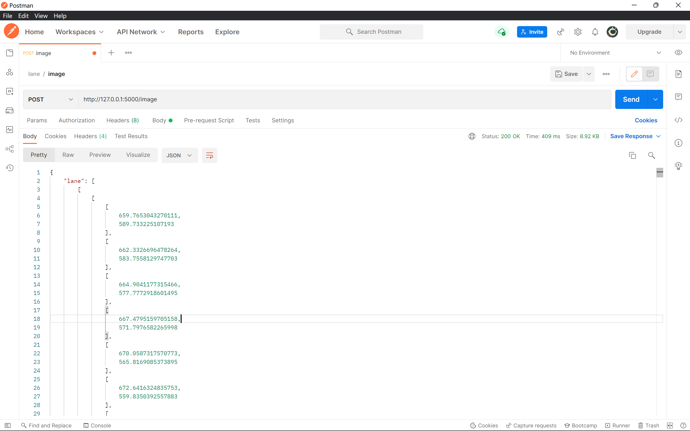
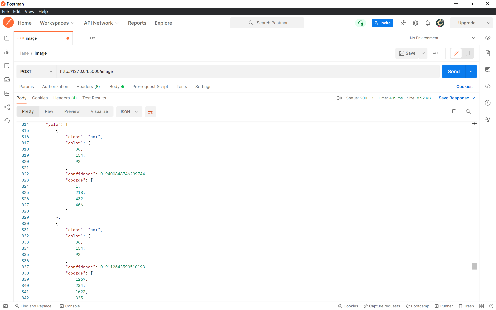

# Flask API for LaneNet and Yolov5s

## Install

1. Create a new conda environment with Python 3.8.13

2. Install Pytorch(CPU) LTS(1.8.2)

   ```shell
   conda install pytorch torchvision torchaudio cudatoolkit=10.2 -c pytorch-lts
   ```

3. Install mmcv(CPU)

   ```shell
   pip install mmcv-full -f https://download.openmmlab.com/mmcv/dist/cpu/torch1.8.2/index.html
   ```

4. Install other requirements

   ```shell
   pip install -r requirement.txt
   ```

## Run

1. Activate your conda environment
2. `python app.py`

## API Example

**JSON data structure:**

```json
{
    "lane": [
        [[x1, y1], [x2, y2] ... ],
        [[x1, y1], [x2, y2] ... ],
        ...
    ],
    "yolo": [
        {
        	"class": "xxx",
        	"color": [R, G, B],
    		"confidence": "0.98572",
    		"coords": [x1, y1, x2, y2]
        },
		...
    ]
}
```

**Postman:**





## File structure

```shell
├─checkpoints # LaneNet
├─configs # LaneNet
├─image
├─models # Yolov5
├─utils # LaneNet
├─yolo_utils # Yolov5
└─yolo_weights # Yolov5
```

