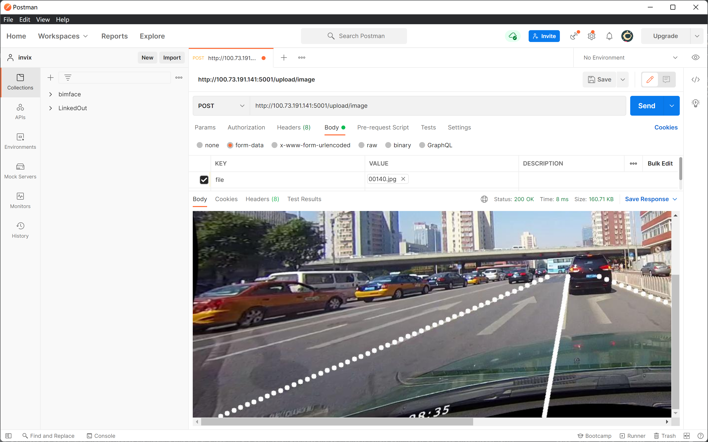

### 安装依赖

服务运行：flask

原检测程序：

cuda10.2(原文档示例)：

```shell
conda create -n pad python=3.6
conda activate pad
conda install pytorch==1.6.0 torchvision==0.7.0 cudatoolkit=10.2 -c pytorch
pip install mmcv-full==1.3.5 -f https://download.openmmlab.com/mmcv/dist/cu102/torch1.6.0/index.html
pip install -r requirements.txt
```

CPU(亲测可用)：

```shell
conda create -n line python=3.6 # 可以新建一个conda环境
conda activate line
conda install pytorch==1.6.0 torchvision==0.7.0 cudatoolkit=10.2 -c pytorch
pip install mmcv-full -f https://download.openmmlab.com/mmcv/dist/cpu/torch1.6.0/index.html
pip install -r requirements.txt
```

### 上传图片并检测

url：/upload/image

method：POST

实现逻辑：上传图片存储至`image`文件夹，调用子进程进行预测，结果图片保存至`image-pred`文件夹，返回图片URL。

配置参数 **(注意检测程序的conda环境名)**

```python
UPLOAD_VIDEO_FOLDER = 'video'
UPLOAD_IMAGE_FOLDER = 'image'
DOWNLOAD_IMAGE_FOLDER = 'image-pred'
CONDA_ENV = 'lane' # conda环境名称, 需要更换成自己设置的
ALLOWED_EXTENSIONS = {'txt', 'pdf', 'png', 'mp4', 'jpg', 'jpeg', 'gif'}
```

接口调用示例

